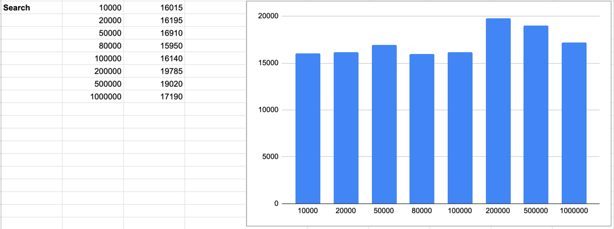
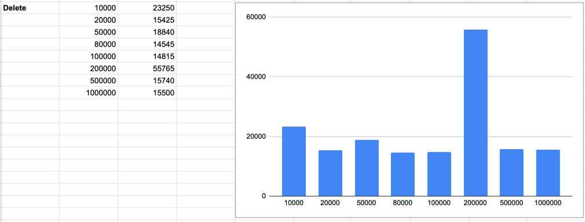

# algorithms-complexity-test
Make BST and Counting Sort, generate 100 random datasets and measure complexity

### Prepare code
`make build && make up`

## Test BST
Run random datasets 20 times for each size from `datasetSizes`, count average per dataset size and output time results in nanoseconds
`datasetSizes := []int{100, 1000, 2000, 5000, 10000, 20000, 50000, 100000}`

### Insert
```shell
algorithms-complexity-test | 2022/01/13 12:51:44 Inserted 100 elements for 77640 nanoseconds
algorithms-complexity-test | 2022/01/13 12:51:44 Inserted 1000 elements for 172960 nanoseconds
algorithms-complexity-test | 2022/01/13 12:51:45 Inserted 2000 elements for 345265 nanoseconds
algorithms-complexity-test | 2022/01/13 12:51:48 Inserted 5000 elements for 942360 nanoseconds
algorithms-complexity-test | 2022/01/13 12:51:53 Inserted 10000 elements for 1988445 nanoseconds
algorithms-complexity-test | 2022/01/13 12:52:04 Inserted 20000 elements for 5108615 nanoseconds
algorithms-complexity-test | 2022/01/13 12:52:32 Inserted 50000 elements for 15881615 nanoseconds
algorithms-complexity-test | 2022/01/13 12:53:26 Inserted 100000 elements for 46150650 nanoseconds
```


### Find
```shell
algorithms-complexity-test | 2022/01/13 12:53:26 Find element from 100 nodes for 16015 nanoseconds
algorithms-complexity-test | 2022/01/13 12:53:27 Find element from 1000 nodes for 16195 nanoseconds
algorithms-complexity-test | 2022/01/13 12:53:28 Find element from 2000 nodes for 16910 nanoseconds
algorithms-complexity-test | 2022/01/13 12:53:30 Find element from 5000 nodes for 15950 nanoseconds
algorithms-complexity-test | 2022/01/13 12:53:36 Find element from 10000 nodes for 16140 nanoseconds
algorithms-complexity-test | 2022/01/13 12:53:46 Find element from 20000 nodes for 19785 nanoseconds
algorithms-complexity-test | 2022/01/13 12:54:14 Find element from 50000 nodes for 19020 nanoseconds
algorithms-complexity-test | 2022/01/13 12:55:08 Find element from 100000 nodes for 17190 nanoseconds
```



### Remove
```shell
algorithms-complexity-test | 2022/01/13 12:55:08 Delete element from 100 nodes for 23250 nanoseconds
algorithms-complexity-test | 2022/01/13 12:55:09 Delete element from 1000 nodes for 15425 nanoseconds
algorithms-complexity-test | 2022/01/13 12:55:10 Delete element from 2000 nodes for 18840 nanoseconds
algorithms-complexity-test | 2022/01/13 12:55:12 Delete element from 5000 nodes for 14545 nanoseconds
algorithms-complexity-test | 2022/01/13 12:55:17 Delete element from 10000 nodes for 14815 nanoseconds
algorithms-complexity-test | 2022/01/13 12:55:28 Delete element from 20000 nodes for 55765 nanoseconds
algorithms-complexity-test | 2022/01/13 12:55:54 Delete element from 50000 nodes for 15740 nanoseconds
algorithms-complexity-test | 2022/01/13 12:56:49 Delete element from 100000 nodes for 15500 nanoseconds
```

